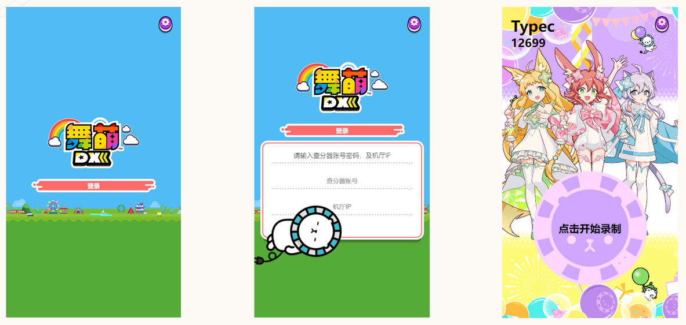

# 一个基于 `Vue3` + `obs-websocket-js` 的舞萌DX内录系统

> <https://vuejs.org/>
>
> <https://github.com/obs-websocket-community-projects/obs-websocket-js>

* 通过前端项目与机厅的内录系统对接可以实现：
  * 多人在线操控一台机器的 OBS 进行录制
  * 查分展示功能
  * 中二节奏主题
  * ……

## 技术选型

* vue3+pinia+axios+webpack+less+**obs-websocket-js**

## 功能部分

* 链接机厅 OBS 进行录制
* 接入查分系统
  * <https://www.diving-fish.com/maimaidx/prober/>

## 注意

* ==**需要手机与机厅内录系统的电脑处在同一局域网内**==

## 项目截图

## 如何使用

1. 克隆本项目到机厅电脑（需要操作OBS），OBS版本需要是最新版（29.1.3）
2. 查看电脑IP（`ipconfig`）
3. 进入到项目目录 `npm run serve`
4. `npm i` 下载项目依赖

* 运行项目后输入查分器账号名和电脑IP
* 点击登录 -> 系统会使用账号名查找对于数据，然后跳转到操作页面
* 点击录制按钮可以控制obs录制和暂停

## 待完成功能

- [ ] 设置页面设计
- [ ] 完善查分UI
- [ ] 用户录制完成后使用账号名和时间重命名放置到制定目录
- [ ] 后端应用搭建，后台页面搭建，**增加用户下载视频功能**
